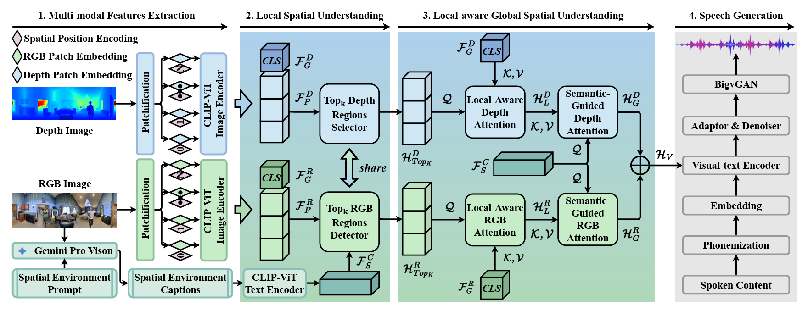

<div align="center">

<h1>M<sup>2</sup>SE-VTTS</h1>
<h3>Multi-Modal and Multi-Scale Spatial Environment Understanding <br> for Immersive Visual Text-to-Speech</h3>

[Rui Liu](https://ttslr.github.io/people.html)<sup>1*</sup>, [Shuwei He](https://github.com/he-shuwei)<sup>1</sup>, Yifan Hu<sup>1</sup>, [Haizhou Li](https://colips.org/~eleliha/)<sup>2,3</sup>

<sup>1</sup> Inner Mongolia University &nbsp;&nbsp; <sup>2</sup> The Chinese University of Hong Kong, Shenzhen &nbsp;&nbsp; <sup>3</sup> National University of Singapore

<sup>*</sup> Corresponding Author

*(Accepted by AAAI 2025)*

</div>

<div align="center">
  <a href="https://arxiv.org/abs/2412.11409">
    
  </a>
  <a href="https://huggingface.co/he-shuwei/M2SE-VTTS">
    
  </a>
  <a href="LICENSE">
    
  </a>
</div>

<br>

## :bookmark: Abstract

Visual Text-to-Speech (VTTS) aims to take the environmental image as the prompt to synthesize the reverberant speech for the spoken content. The challenge of this task lies in understanding the spatial environment from the image. Many attempts have been made to extract global spatial visual information from the RGB space of a spatial image. However, local and depth image information are crucial for understanding the spatial environment, which previous works have ignored. To address the issues, we propose a novel multi-modal and multi-scale spatial environment understanding scheme to achieve immersive VTTS, termed M<sup>2</sup>SE-VTTS. The multi-modal aims to take both the RGB and Depth spaces of the spatial image to learn more comprehensive spatial information, and the multi-scale seeks to model the local and global spatial knowledge simultaneously. Specifically, we first split the RGB and Depth images into patches and adopt the Gemini-generated environment captions to guide the local spatial understanding. After that, the multi-modal and multi-scale features are integrated by the local-aware global spatial understanding. In this way, M<sup>2</sup>SE-VTTS effectively models the interactions between local and global spatial contexts in the multi-modal spatial environment. Objective and subjective evaluations suggest that our model outperforms the advanced baselines in environmental speech generation.

## :mag: Overview

<p align="center">
  
</p>

## :checkered_flag: Installation

```bash
# Clone the repository
git clone https://github.com/he-shuwei/M2SE-VTTS.git
cd M2SE-VTTS

# Create environment
conda create -n m2se-vtts python=3.8 -y
conda activate m2se-vtts

# Install dependencies
pip install -r requirements.txt
```

**Checkpoints & Data** &mdash; download from [HuggingFace](https://huggingface.co/he-shuwei/M2SE-VTTS):

| Resource | Path | Description |
|---|---|---|
| M2SE-VTTS (finetuned) | `checkpoints/m2se_vtts/` | Finetuned model for inference |
| Pretrain Encoder | `checkpoints/pretrain_encoder/` | Pretrained encoder (Emilia, MLM) |
| Pretrain Decoder | `checkpoints/pretrain_decoder/` | Pretrained decoder (Emilia, Diffusion) |
| BigVGAN v2 | `checkpoints/bigvgan/` | Retrained vocoder (16 kHz) |
| Spatial environment captions | `data/raw_data/captions/` | Gemini-generated captions for all splits |
| MFA alignment results | `data/processed_data/mfa/outputs/` | Pre-computed forced alignment (TextGrid) |

The following third-party checkpoints are also required. Please download from their official sources:

| Model | Path | Source |
|---|---|---|
| CLIP ViT-L/14-336 | `checkpoints/clip-vit-large-patch14-336/` | [OpenAI](https://huggingface.co/openai/clip-vit-large-patch14-336) |
| ECAPA-TDNN | `checkpoints/spk_encoder/` | [SpeechBrain](https://huggingface.co/speechbrain/spkrec-ecapa-voxceleb) |
| RMVPE | `checkpoints/RMVPE/rmvpe.pt` | [RMVPE](https://github.com/Dream-High/RMVPE) |

**Data** &mdash; this project uses the [SoundSpaces-Speech](https://github.com/facebookresearch/learning-audio-visual-dereverberation) dataset. Please follow their instructions to obtain the raw data, then run the preprocessing pipeline:

```bash
python scripts/data_preprocessing/finetune/01_filter_data.py --splits train val-mini test-seen test-unseen
python scripts/data_preprocessing/finetune/02_extract_pkl.py --splits train val-mini test-seen test-unseen
python scripts/data_preprocessing/finetune/03_extract_clip.py --splits train val-mini test-seen test-unseen
python scripts/data_preprocessing/finetune/03b_extract_spk_embed.py
bash scripts/data_preprocessing/finetune/04_run_mfa.sh --jobs 64
python scripts/data_preprocessing/finetune/05_binarize.py --config configs/m2se_vtts.yaml
```

## :steam_locomotive: Training

Modify `CUDA_VISIBLE_DEVICES` and paths in `scripts/finetune/run_train.sh` as needed, then:

```bash
bash scripts/finetune/run_train.sh configs/m2se_vtts.yaml m2se_vtts
```

## :speaker: Inference

Modify checkpoint paths and parameters in `scripts/infer/run_infer.sh` as needed, then:

```bash
bash scripts/infer/run_infer.sh \
    --ckpt checkpoints/m2se_vtts/model_ckpt_best.pt \
    --outdir results/m2se_vtts/test_seen \
    --batch_size 16
```

## :pencil: Citation

If you find this work useful, please consider citing:

```bibtex
@inproceedings{liu2025multi,
  title={Multi-modal and multi-scale spatial environment understanding for immersive visual text-to-speech},
  author={Liu, Rui and He, Shuwei and Hu, Yifan and Li, Haizhou},
  booktitle={Proceedings of the AAAI Conference on Artificial Intelligence},
  volume={39},
  number={23},
  pages={24632--24640},
  year={2025}
}
```

## :raised_hands: Acknowledgments

This project builds upon several excellent open-source projects. We gratefully acknowledge:

- [NATSpeech](https://github.com/NATSpeech/NATSpeech) &mdash; non-autoregressive TTS framework
- [DiffSinger](https://github.com/MoonInTheRiver/DiffSinger) &mdash; diffusion-based acoustic model
- [F5-TTS](https://github.com/SWivid/F5-TTS) &mdash; Diffusion Transformer (DiT) architecture
- [BigVGAN](https://github.com/NVIDIA/BigVGAN) &mdash; neural vocoder by NVIDIA
- [SoundSpaces-Speech](https://github.com/facebookresearch/learning-audio-visual-dereverberation) &mdash; audio-visual dataset by Meta Research
- [CLIP](https://github.com/openai/CLIP) &mdash; visual-language encoder by OpenAI
- [RMVPE](https://github.com/Dream-High/RMVPE) &mdash; robust pitch extractor
